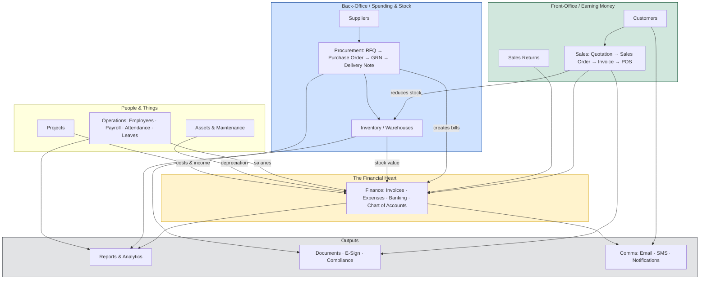
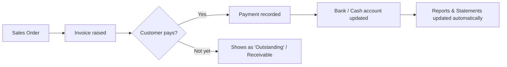
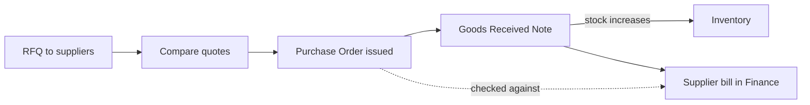
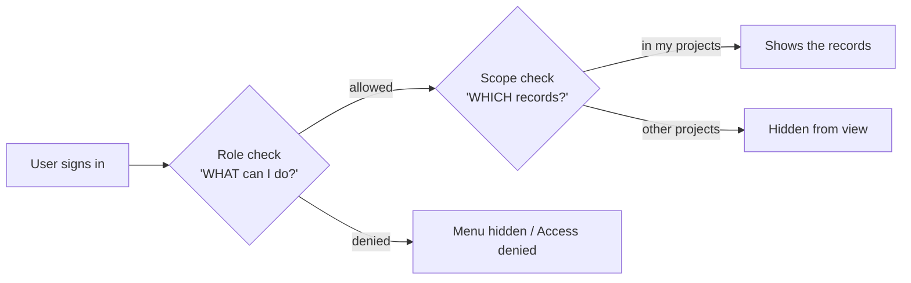
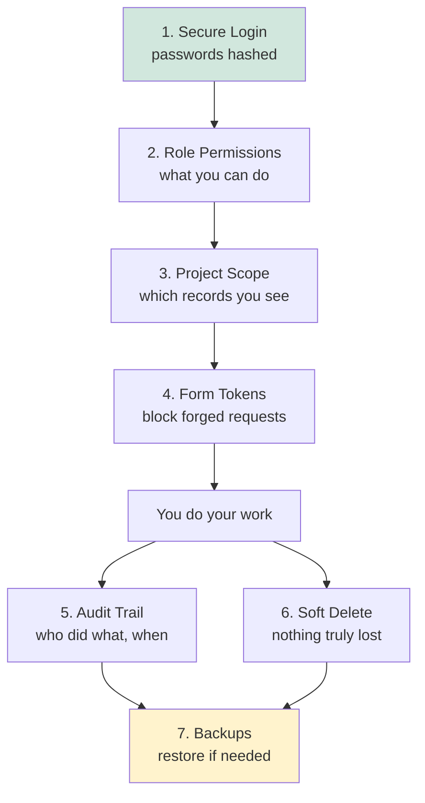

# BUSINESS MANAGEMENT SYSTEM
### Complete User & Training Guide

> A plain-language guide for new users, trainers, and prospective customers.
> No technical knowledge required — if you can use a web browser, you can use this system.

---

## TABLE OF CONTENTS

1. [Part 1 — Introduction: What Is the Business Management System?](#part-1)
2. [Part 2 — Who Uses the System (User Roles)](#part-2)
3. [Part 3 — The Sections of the System (Map & Overview)](#part-3)
4. [Part 4 — How Each Section Works (Detailed Walkthrough)](#part-4)
5. [Part 5 — Security Features & How They Protect You](#part-5)
6. [Part 6 — Quick-Start Cheat Sheet](#part-6)

---

<a name="part-1"></a>
# PART 1 — INTRODUCTION

## What Is the Business Management System?

The **Business Management System (BMS)** is an all-in-one web-based platform that runs the *entire* operation of a business from a single screen. Instead of using separate programs for sales, accounting, stock, staff, and reporting — and instead of paper files and spreadsheets — everything lives in one secure, connected system.

A user simply opens a web browser, logs in, and works. There is nothing to install on the computer. It works on a desktop, a laptop, a tablet, or a phone.

### What the system does, in one sentence

> It captures every business activity — a sale, a purchase, a payment, a delivery, a staff record — **once**, and then automatically connects that information across accounting, stock, and reports, so the business always knows exactly where it stands.

### Why a business would want it

| Without BMS | With BMS |
|---|---|
| Sales in one book, accounts in another | Everything connected automatically |
| Stock counted by hand | Stock updates itself on every sale & purchase |
| Reports take days to prepare | Reports appear instantly |
| Hard to know who did what | Every action is recorded with name, date & time |
| Anyone can see everything | Each person sees only what their job needs |
| Data can be lost | Data is backed up and never truly deleted |

### Key characteristics

- **Web-based** — accessed through a browser; no software to install.
- **Mobile-friendly** — the screen automatically reshapes for phones and tablets.
- **Role-based** — each employee gets their own login and sees only their part.
- **Connected** — a single transaction flows through stock, accounts, and reports.
- **Localised** — built for the local business environment (currency in TZS, local tax rules, local date/time).
- **Audited** — every important action is logged for accountability.

---

<a name="part-2"></a>
# PART 2 — WHO USES THE SYSTEM (USER ROLES)

Every person who uses the system has their own **username and password**. What they can see and do is decided by their **Role**.

A **Role** is simply a job profile (for example "Cashier" or "Accountant"). The administrator attaches a set of **permissions** to each role, and then assigns each employee to a role. This means a salesperson never sees payroll, and a cashier cannot change company settings.

## The standard roles

The system ships with common business roles, and the administrator can **create as many new roles as needed** with custom names. Typical roles include:

| Role | Typical responsibility | Sees / does |
|---|---|---|
| **Administrator** | Owner / IT manager | Full access to everything, including settings, users and backups |
| **Manager** | Department / branch head | Reviews and approves work; sees most operational areas and reports |
| **Accountant** | Finance officer | Invoices, expenses, banking, journals, financial reports |
| **Cashier** | Front-desk / till operator | Point of Sale (POS), receipts, daily cash |
| **Sales** | Salesperson | Customers, quotations, sales orders, invoices |
| **Storekeeper** | Warehouse / stock keeper | Products, stock movements, deliveries, GRN |
| **HR Officer** | Human resources | Employees, attendance, leaves, payroll |
| **Procurement Officer** | Buyer | Suppliers, RFQs, purchase orders |
| **Loan Officer** | Lending staff | Loan applications and repayments |

> **Custom roles:** Beyond these, an administrator can build any role — for example "Branch Supervisor — Arusha" — and tick exactly which areas that role may use.

## What a permission actually controls

For every section of the system, a role can be granted any combination of six actions:

```
   VIEW      →  can open and read the page
   CREATE    →  can add new records
   EDIT      →  can change existing records
   DELETE    →  can remove records
   REVIEW    →  can check & forward a record in a workflow
   APPROVE   →  can give final sign-off
```

This is what makes the system safe for many users at once: a junior clerk might have **View + Create** on invoices, while only a manager has **Approve**.

### Diagram — How a user gets their access

```
        ┌──────────────┐         ┌──────────────┐         ┌────────────────────┐
        │   EMPLOYEE   │ ──────► │     ROLE     │ ──────► │   PERMISSIONS      │
        │ (login name) │ assigned│ (job profile)│  grants │ View/Create/Edit/  │
        │              │  to one │              │         │ Delete/Review/     │
        │              │         │              │         │ Approve per section│
        └──────────────┘         └──────────────┘         └────────────────────┘
                                                                     │
                                                                     ▼
                                                        The menus and buttons the
                                                        user sees are switched ON
                                                        or OFF based on these ticks.
```

The administrator manages all of this from **Admin → Roles & Permissions** using a simple grid of tick-boxes — no technical skill required.

---

<a name="part-3"></a>
# PART 3 — THE SECTIONS OF THE SYSTEM (MAP & OVERVIEW)

After logging in, the user sees a **top navigation bar**. Each item on the bar is a **Section**, and most sections open a **drop-down menu** of sub-parts. The user's account menu sits on the far right.

> **Important:** A user only sees the sections their role allows. The map below shows *everything* the system contains; a typical user sees a smaller subset.

## 3.1 The complete navigation map

```
BUSINESS MANAGEMENT SYSTEM  ───────────────────────────────────  [ 👤 User Name ▼ ]
│
├── 🏠 CORE
│     ├── Dashboard
│     ├── Customers
│     ├── Suppliers
│     ├── Sub-Contractors
│     ├── Inventory Products
│     └── Non-Inventory Products
│
├── 💵 FINANCE
│     ├── Expenses · Budget · Chart of Accounts
│     ├── Bank Accounts · Cash Register · Petty Cash · Reconciliation
│     └── Invoices · Received Invoices · PO vs Invoice Report · Purchase Orders · Payment Vouchers
│
├── 🛒 SALES
│     ├── Sales Orders · Invoices · Received Invoices
│     ├── POS (Point of Sale) · Quotations
│     └── Sales Returns
│
├── 📦 INVENTORY
│     ├── Inventory Products · Non-Inventory Products · Categories
│     ├── Stock Adjustments · Valuation
│     └── Warehouses · Locations
│
├── 🧺 PROCUREMENT
│     ├── Suppliers · RFQ (Request for Quotation)
│     ├── Purchase Order · Delivery Note (DN) · GRN (Goods Received Note)
│     └── Return Note · Materials · Tenders
│
├── ⚙️ OPERATIONS
│     ├── Employees · Payroll · Attendance · Leaves
│     └── Assets · Maintenance
│
├── 📋 PROJECTS   (single page — shown when projects are enabled)
│
├── 💬 COMMS
│     ├── Messages · Email · SMS · Notifications
│     └── Campaigns · Leads
│
├── 📁 DOCS
│     ├── Library · Templates · E-Sign
│     └── Compliance · Audit Logs
│
├── 📈 REPORTS  (large "mega menu" in four columns)
│     ├── Financial:   Income Statement · Balance Sheet · Cash Flow · Trial Balance · General Ledger
│     ├── Business:    Sales · Purchase · Inventory · Expense
│     ├── Analytics:   Performance · Customer Analysis · Product Analysis · Sales Forecast · Trends
│     └── Compliance:  Tax · Audit · Compliance · Employee · Asset
│
└── 🎛️ ADMIN   (administrators only)
      ├── User Management:       Users · Roles & Permissions · Project Assignments
      ├── System Configuration:  Settings · Company Profile · Backup
      └── Business Settings:     Tax · Payments · Notifications

[ 👤 User Account Menu ]  ──►  Profile · Settings · Help · Logout
```

## 3.2 How the sections relate to each other

The real power of the system is that the sections are **connected**. An action in one section automatically updates others. The diagram below shows the main flow of information.



**Read the diagram like this:** money comes in through **Sales**, money and goods come in through **Procurement & Inventory**, people and assets are managed in **Operations**, and *everything* settles into **Finance**, which then feeds **Reports**. The connecting arrows happen **automatically** — the user does not re-type the same information twice.

---

<a name="part-4"></a>
# PART 4 — HOW EACH SECTION WORKS (DETAILED WALKTHROUGH)

Each section below explains, in plain language: **what it is for**, **how a user works with it**, and **how it connects to the rest of the system**. Every section follows the same on-screen pattern, so once a user learns one, they can use them all.

## The universal page layout

Almost every list page in the system looks the same. Learn it once:

```
┌──────────────────────────────────────────────────────────────────┐
│  📄 Page Title                                   [ + Add New ]     │  ← title + create button
├──────────────────────────────────────────────────────────────────┤
│  [ Total: 120 ]  [ Active: 95 ]  [ Pending: 18 ]  [ Closed: 7 ]   │  ← summary metric cards
├──────────────────────────────────────────────────────────────────┤
│  🔍 Search...                      [ Export ▼ ]  [ Print ]         │  ← search + tools
├──────────────────────────────────────────────────────────────────┤
│  #  | Name          | Status     | Date       |   Actions          │
│  1  | ABC Ltd       | ● Active   | 02 Jun 26  |  [👁] [✏] [🗑]      │  ← rows with action icons
│  2  | XYZ Traders   | ● Pending  | 01 Jun 26  |  [👁] [✏] [🗑]      │
└──────────────────────────────────────────────────────────────────┘
   👁 View   ✏ Edit   🗑 Delete    (buttons only appear if your role allows them)
```

On a phone, the same table automatically becomes a stack of tidy cards — no sideways scrolling.

---

## 4.1 🏠 CORE

**Purpose:** The foundation records that the rest of the business is built on — the people you sell to, the people you buy from, and the things you sell.

| Sub-part | What it is | How it's used |
|---|---|---|
| **Dashboard** | The home screen | Shows headline figures (sales, cash, stock alerts) the moment you log in |
| **Customers** | Your client list | Add a customer once; reuse them on every quotation, order and invoice |
| **Suppliers** | Your vendor list | Add a supplier once; reuse on RFQs, purchase orders and bills |
| **Sub-Contractors** | Outside parties on projects | Track contractors engaged for project work |
| **Inventory Products** | Physical goods you stock | Items whose quantity is counted and tracked |
| **Non-Inventory Products** | Services / non-stock items | Things you sell that are not counted as stock (e.g. consulting, labour) |

**Dashboard snapshot:**

```
┌───────────── DASHBOARD ─────────────────────────────────┐
│  Today's Sales     Cash in Hand     Stock Alerts        │
│   TZS 1,250,000      TZS 480,000        ⚠ 6 low items    │
│ ───────────────────────────────────────────────────────│
│  📈 Sales this month        📊 Top products             │
│      [ trend chart ]            [ bar chart ]           │
└──────────────────────────────────────────────────────────┘
```

**How Core connects:** Customers feed **Sales**; Suppliers feed **Procurement**; Products feed **Inventory, Sales and Procurement**. These are the building blocks everything else points to.

---

## 4.2 💵 FINANCE

**Purpose:** The financial heart of the business — where money owed, money spent, and money in the bank are all recorded and balanced.

| Group | Sub-parts | What they do |
|---|---|---|
| **Accounting** | Expenses · Budget · Chart of Accounts | Record costs, set spending plans, and organise the list of accounts money is grouped under |
| **Banking & Cash** | Bank Accounts · Cash Register · Petty Cash · Reconciliation | Track every bank and cash account, and match the system's records against the real bank statement |
| **Sales & Purchases** | Invoices · Received Invoices · PO vs Invoice Report · Purchase Orders · Payment Vouchers | Bills you send to customers, bills you receive from suppliers, and the payments that settle them |

**How a bill flows (example — a customer invoice):**



**How Finance connects:** Sales create customer invoices here; Procurement creates supplier bills here; Payroll posts salaries here; Assets post depreciation here. Finance then feeds every figure in the **Reports** section. It is the section that *receives* from almost everything else.

---

## 4.3 🛒 SALES

**Purpose:** Everything involved in selling — from a price quote to a finished sale.

| Sub-part | What it is |
|---|---|
| **Quotations** | A price offer sent to a customer before they commit |
| **Sales Orders** | A confirmed order from a customer |
| **Invoices** | The official bill requesting payment |
| **POS (Point of Sale)** | A fast till screen for over-the-counter sales |
| **Sales Returns** | Goods a customer brings back |

**The natural sales journey:**

```
  Quotation  ──accepted──►  Sales Order  ──delivered──►  Invoice  ──paid──►  Receipt
     │                                                       │
     └── (or, for a quick counter sale) ──►  POS  ──────────►┘
```

**How Sales connects:** It pulls **Customers** and **Products** from Core, **reduces stock** in Inventory when goods go out, and **creates the invoice** that lands in Finance. A sale therefore touches three sections at once — automatically.

---

## 4.4 📦 INVENTORY

**Purpose:** Knowing exactly what stock you have, where it is, and what it is worth.

| Group | Sub-parts | What they do |
|---|---|---|
| **Stock Management** | Inventory Products · Non-Inventory Products · Categories · Stock Adjustments · Valuation | Maintain the product list, group items into categories, correct counts, and value the stock on hand |
| **Warehouse** | Warehouses · Locations | Define each storage site and the specific shelves/bins inside it |

**How stock levels move:**

```
   Purchase (GRN received)  ──►  ⬆ Stock goes UP
   Sale / POS               ──►  ⬇ Stock goes DOWN
   Stock Adjustment         ──►  ⬆/⬇ Manual correction (with reason)
   Transfer between stores  ──►  moves between Warehouses
                                  │
                                  ▼
                       Valuation report shows
                       the live money value of stock
```

**How Inventory connects:** It goes **up** when Procurement receives goods (GRN), goes **down** when Sales/POS sell them, and its total value flows into **Finance** and the **Inventory Report**.

---

## 4.5 🧺 PROCUREMENT

**Purpose:** Everything involved in buying — from asking suppliers for prices to receiving the goods.

| Sub-part | What it is |
|---|---|
| **Suppliers** | The vendor list (shared with Core) |
| **RFQ (Request for Quotation)** | Asking several suppliers to quote a price |
| **Purchase Order (PO)** | The official order you send to a chosen supplier |
| **Delivery Note (DN)** | Record of goods movement in/out |
| **GRN (Goods Received Note)** | Confirmation that ordered goods arrived |
| **Return Note** | Sending faulty goods back to the supplier |
| **Materials** | Materials used (e.g. on projects) |
| **Tenders** | Managing formal tender / bid processes |

**The natural buying journey:**



**How Procurement connects:** It uses **Suppliers** and **Products**, **increases Inventory** when a GRN is recorded, and **creates the supplier bill** in Finance. The *PO vs Invoice Report* later confirms you were billed only for what you ordered.

---

## 4.6 ⚙️ OPERATIONS

**Purpose:** Managing the business's people and its physical equipment.

| Group | Sub-parts | What they do |
|---|---|---|
| **Human Resources** | Employees · Payroll · Attendance · Leaves | Staff records, salary processing, daily attendance, and leave requests |
| **Assets & Maintenance** | Assets · Maintenance | Register company equipment (and its depreciation) and schedule servicing |

**How Operations connects:** **Payroll** posts salary costs into Finance; **Assets** post depreciation into Finance; staff and assets can be linked to **Projects**. Attendance and leaves feed into payroll calculations.

```
  Employees ──► Attendance ──► Payroll ──► Salary expense in FINANCE
  Assets ─────► Depreciation ──────────► Asset cost in FINANCE
  Assets ─────► Maintenance schedule ──► service reminders
```

---

## 4.7 📋 PROJECTS

**Purpose:** When enabled, this groups income, costs, materials, staff and sub-contractors under a named project so you can see if each job is profitable.

**How Projects connects:** It acts like a "tag" that pulls together related **purchases, materials, sub-contractors and invoices**, then reports the project's budget vs actual spend. (Projects also drive part of the security model — see Part 5.)

```
        ┌──────────── PROJECT: "Office Block A" ───────────┐
        │  + Purchase Orders   + Materials used            │
        │  + Sub-contractors   + Staff assigned            │
        │  + Customer invoices                             │
        │  ───────────────────────────────────────────────│
        │  = Budget vs Actual  →  Profit/Loss for this job │
        └──────────────────────────────────────────────────┘
```

---

## 4.8 💬 COMMS

**Purpose:** Reaching customers and staff, and keeping everyone informed.

| Group | Sub-parts | What they do |
|---|---|---|
| **Communication** | Messages · Email · SMS · Notifications | Internal messages, e-mail templates, SMS sending, and in-system alerts |
| **Marketing** | Campaigns · Leads | Run promotional campaigns and capture potential new customers |

**How Comms connects:** It draws on **Customers** for contact details and on **Finance** for events worth notifying (e.g. an overdue invoice reminder). Leads that convert become Customers in Core.

---

## 4.9 📁 DOCS

**Purpose:** A central, secure home for the business's documents, templates, signatures and compliance records.

| Group | Sub-parts | What they do |
|---|---|---|
| **Document Management** | Library · Templates · E-Sign | Store files, reuse standard document templates, and sign documents electronically |
| **Compliance** | Compliance · Audit Logs | Track licences/certificates and their expiry, and review the record of who did what |

**How Docs connects:** Documents can be attached to customers, suppliers, projects and transactions. **Compliance** watches for expiring licences and warns through **Comms**. **Audit Logs** record activity from every section (see Part 5).

```
   Templates ──► generate a document ──► E-Sign ──► stored in Library
   Compliance ──► licence expiring soon ──► automatic reminder (Comms)
   Every section ──► writes an entry ──► Audit Logs
```

---

## 4.10 📈 REPORTS

**Purpose:** Turning all the captured data into decisions. This is presented as a wide "mega-menu" in four columns.

| Column | Reports | Answers the question… |
|---|---|---|
| **Financial** | Income Statement · Balance Sheet · Cash Flow · Trial Balance · General Ledger | "Are we profitable? What do we own and owe?" |
| **Business** | Sales · Purchase · Inventory · Expense | "What did we sell, buy, stock and spend?" |
| **Analytics** | Performance · Customer Analysis · Product Analysis · Sales Forecast · Trends | "Who/what performs best? What's coming next?" |
| **Compliance & Operations** | Tax · Audit · Compliance · Employee · Asset | "Are we compliant? Who did what? How are staff & assets?" |

**How Reports connects:** Reports **only read** information; they never change it. They gather figures that the other sections produced and present them instantly. This is why accurate day-to-day data entry matters — the reports are only ever as good as the records behind them.

```
   SALES ─┐
   FINANCE┤
   STOCK  ├──►  REPORTS  ──►  Screen view · Excel export · Printable PDF
   HR     ┤
   ASSETS ┘
```

---

## 4.11 🎛️ ADMIN (Administrators only)

**Purpose:** The control room. Only administrators see this section. It configures the whole system.

| Group | Sub-parts | What they do |
|---|---|---|
| **User Management** | Users · Roles & Permissions · Project Assignments | Create staff logins, define what each role can do, and assign users to projects |
| **System Configuration** | Settings · Company Profile · Backup | General settings, company name/logo, and safe data backups |
| **Business Settings** | Tax · Payments · Notifications | Tax rates, payment methods, and alert preferences |

**How Admin connects:** Admin sits *above* everything. **Roles & Permissions** decides which menus every other user sees. **Company Profile** controls the name and logo shown on every screen and printed document. **Backup** protects all the data the other sections create.

```
   ADMIN ─ Roles & Permissions ──► controls visibility of ALL sections above
   ADMIN ─ Company Profile ──────► branding on every page & printout
   ADMIN ─ Backup ───────────────► safety net for all data
```

---

## 4.12 👤 USER ACCOUNT MENU (top-right, for everyone)

Every logged-in user has a personal menu in the top-right corner:

| Item | What it does |
|---|---|
| **Profile** | View and update your own details |
| **Settings** | Personal preferences |
| **Help** | Guidance and support |
| **Logout** | Safely end your session |

---

<a name="part-5"></a>
# PART 5 — SECURITY FEATURES & HOW THEY PROTECT YOU

Security is built into every layer of the system. The goal is simple: **the right people can do their work easily, and the wrong people cannot get in or see what they shouldn't.** Here is each protection, explained plainly.

## 5.1 Secure login (Authentication)

Every user must sign in with a **username and password**. Passwords are never stored as plain text — they are stored in a scrambled (hashed) form that even an administrator cannot read. When you log in, the system checks your typed password against the scrambled version. If it doesn't match, access is refused.

```
   You type password  ──►  System scrambles it  ──►  Compares to stored scramble
                                                          │
                                          ┌───────────────┴───────────────┐
                                      ✅ Match: let in              ❌ No match: refuse
```

The time of each successful login is recorded, so unusual activity can be spotted.

## 5.2 Role-Based Access Control — "what you can do"

As explained in Part 2, every user belongs to a **Role**, and each role has a tick-box grid of permissions (View, Create, Edit, Delete, Review, Approve) for every section.

- If your role can't **view** a section, its menu item simply **does not appear** for you.
- If your role can view but not **edit**, you'll see records but the *Edit* button is hidden.
- Administrators bypass these checks and can access everything.

This is the system's first answer to *"what is this person allowed to do?"*

```
   Role: CASHIER
   ┌─────────────┬──────┬────────┬──────┬────────┐
   │ Section     │ View │ Create │ Edit │ Delete │
   ├─────────────┼──────┼────────┼──────┼────────┤
   │ POS         │  ✔   │   ✔    │  ✔   │   ✘    │
   │ Customers   │  ✔   │   ✔    │  ✘   │   ✘    │
   │ Payroll     │  ✘   │   ✘    │  ✘   │   ✘    │  ← menu hidden entirely
   │ Settings    │  ✘   │   ✘    │  ✘   │   ✘    │
   └─────────────┴──────┴────────┴──────┴────────┘
```

## 5.3 Project-Scope Access — "which records you can see"

There is a **second, deeper layer** of control. Even when two users have the same role, they can be limited to different **data** by assigning them to specific **projects** (Admin → Project Assignments). A site supervisor for "Project A" sees Project A's purchases and records, not Project B's.

> Think of it as two locks: the **role** decides *what kind of actions* you may perform; the **project scope** decides *which specific records* those actions apply to.



## 5.4 Protection against fake/forged requests (CSRF)

Every form in the system carries a hidden, single-use **security token**. When you save something, the system checks that the token is genuine and current. This stops a malicious website from secretly submitting actions on your behalf while you're logged in. If the token is missing or stale, the action is blocked with a "please refresh and try again" message.

## 5.5 Full activity & audit trail — accountability

The system keeps a permanent record of important actions: **who** did it, **what** they did, **when**, and from **which device/location** (IP address). 

- The **Audit Logs** and **Audit Report** (in Docs and Reports) let managers review this history.
- This means nothing happens anonymously — if a record is changed or deleted, there is always a name and timestamp attached.

```
   ┌──────────────────────────────────────────────────────────────┐
   │ AUDIT LOG                                                      │
   │ 02 Jun 26 10:14 │ J. Mushi  │ Created invoice #1043 │ 10.0.0.5│
   │ 02 Jun 26 10:09 │ A. Admin  │ Granted 'Approve' to Manager     │
   │ 02 Jun 26 09:55 │ M. Salum  │ Deleted product 'Old SKU'        │
   └──────────────────────────────────────────────────────────────┘
```

## 5.6 Records are never truly destroyed (Soft Delete)

When a user "deletes" a record, the system **hides** it rather than erasing it permanently. The data stays safely in the background, out of everyday views, but recoverable if a deletion was a mistake or needs investigation. This protects the business from accidental or malicious data loss.

## 5.7 Protection against malicious input (XSS prevention)

Anything a user types and the system later displays is automatically "cleaned" so that hidden malicious code cannot run in another user's browser. Users never need to think about this — it happens behind the scenes on every screen.

## 5.8 Compliance & document-expiry monitoring

The system quietly checks (once a day) for licences, certificates and documents that are about to expire, and raises alerts in good time. This keeps the business on the right side of regulators without anyone having to remember dates.

## 5.9 Backups — the safety net

Administrators can take **backups** of all the system's data (Admin → Backup). If hardware fails or data is corrupted, the business can be restored to a known good point. Combined with soft-delete, this gives two layers of data protection.

## 5.10 Security at a glance



**In summary:** the system controls *who gets in* (login), *what they may do* (roles), *which data they touch* (project scope), *protects each action* (tokens & input cleaning), *records everything* (audit trail), and *never loses anything* (soft delete + backups).

---

<a name="part-6"></a>
# PART 6 — QUICK-START CHEAT SHEET

For a brand-new user on their first day:

```
1. Open the browser and go to the system address.
2. Log in with the username & password your administrator gave you.
3. You land on the DASHBOARD — your business at a glance.
4. The TOP BAR shows only the sections your role allows.
5. To find something, open the matching section:
       • A customer / supplier / product → CORE
       • Make a sale or quote            → SALES
       • Buy something                   → PROCUREMENT
       • Money, bills, banking           → FINANCE
       • Stock levels                    → INVENTORY
       • Staff, payroll, assets          → OPERATIONS
       • See how the business is doing   → REPORTS
6. On any list page:
       • [ + Add New ] to create        • 👁 to view        
       • ✏ to edit                      • 🗑 to delete
       • 🔍 to search                   • Export / Print as needed
7. When finished, use the 👤 top-right menu → Logout.
```

**Golden rules for trainees**
- Enter information **once, correctly** — the system connects it everywhere else for you.
- If a button or menu is missing, it's because your **role** doesn't include it — ask your administrator.
- Every action you take is **recorded** — work with confidence, but accurately.
- When in doubt, use **👤 → Help**.

---

*This guide describes the system from the user-interface perspective only. For technical setup, contact your system administrator or the BMS support team.*
